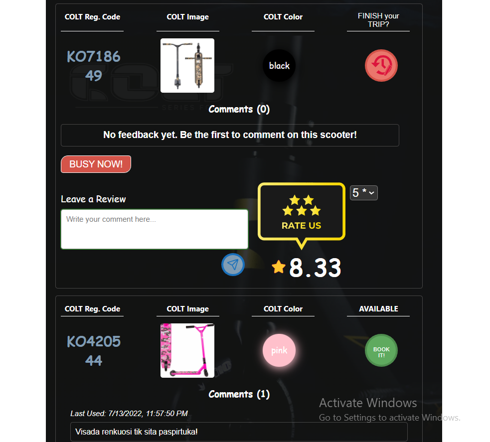
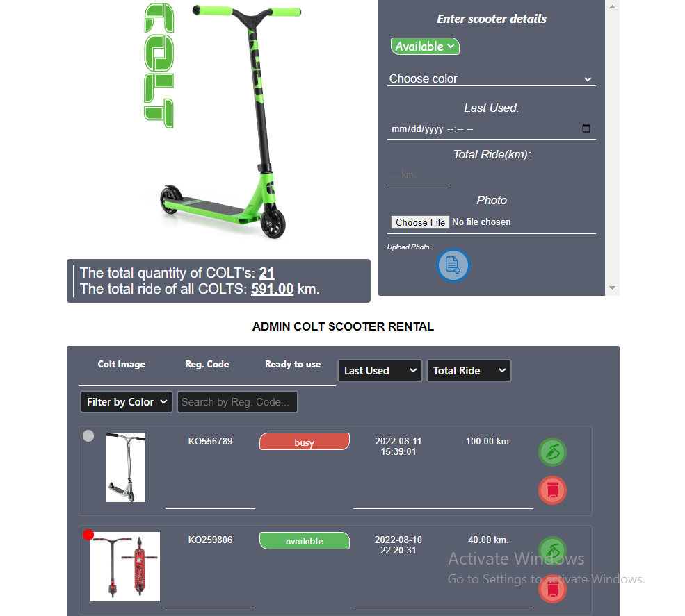
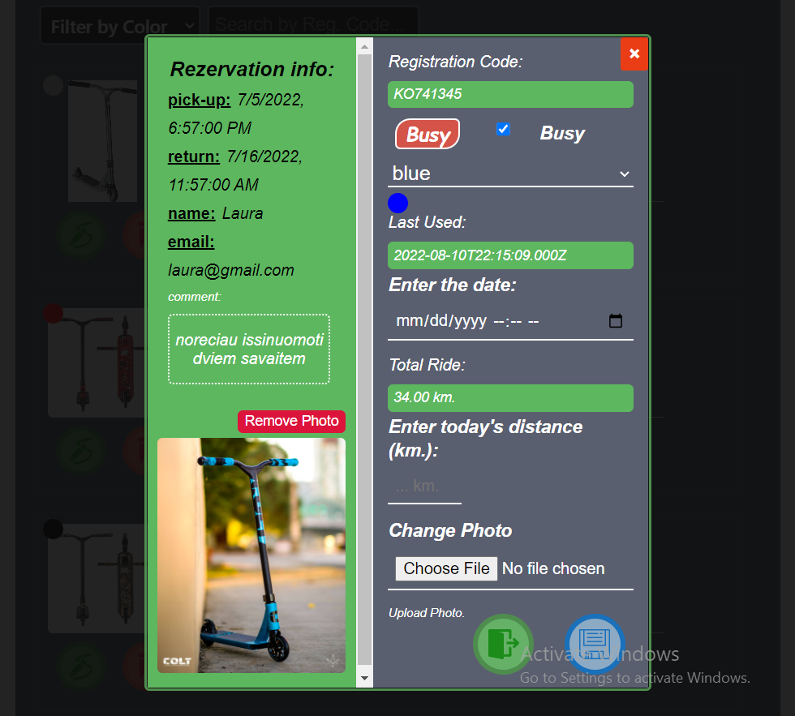
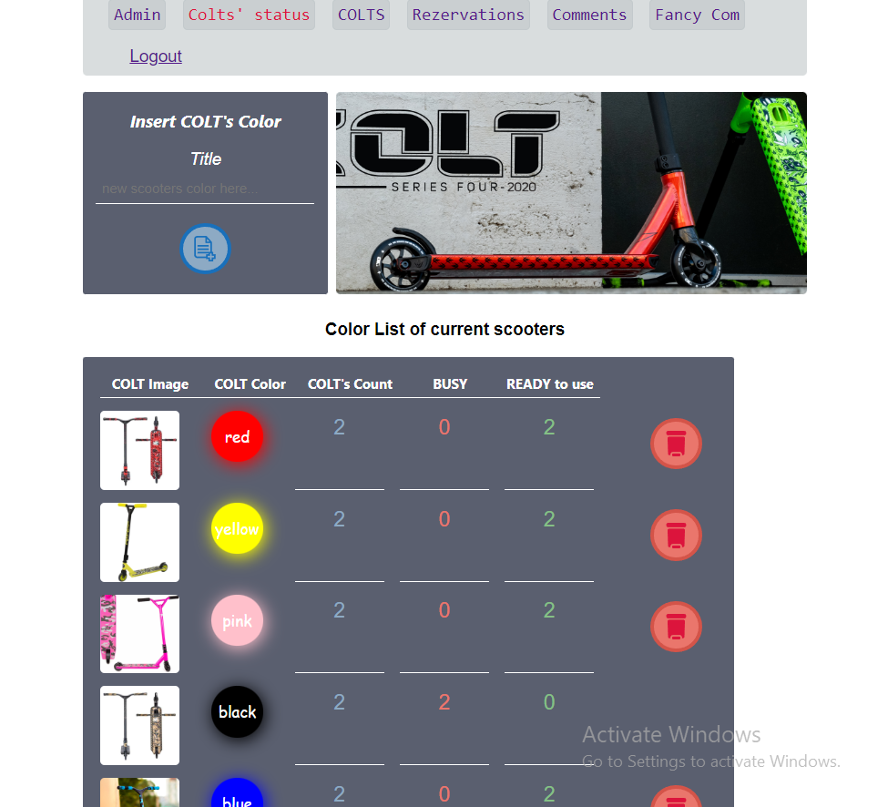
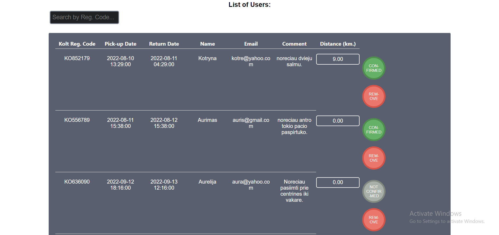
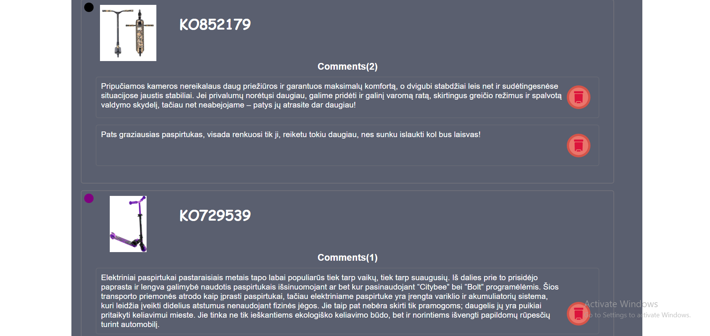

# SCOOTER-RENTAL (COLTS)

Scooter-rental server project

Public domain site design: 

Administrative domain site design: !

_To launch this project in your browser, you should follow the steps below_

First, create a folder of your project, name it as react-node-app , open this folder in your text editor

1. REACT FRONT-END

git clone [repository url]

cd [local repository]

/Check package.json file and ensure scripts are notated as below:

"scripts": {
"start": "react-scripts start",
"build": "react-scripts build",
"test": "react-scripts test",
"eject": "react-scripts eject"
},

/_ Delete the node_modules folder and any 'lock' files such as
yarn.lock or package-lock.json if present._/

npm install

npm start

2. BACKEND

To create our Node project open your terminal and create a new folder with the name server. Run the following command:

npm init -y
By running this you will see package.json file has been created in our folder, This file will help us to manage dependencies our app needs.

Now, in our terminal we will install express as a dependency

npm i express
After that, we will create a script in package.json that will start our web server when we run it with npm start:

...
"scripts": {
"start": "node server/index.js"
},
...
Our package.json file should look like this

{
"name": "react-node-app",
"version": "1.0.0",
"description": "",
"main": "index.js",
"scripts": {
"test": "echo \"Error: no test specified\" && exit 1",
"start": "node server/index.js"
},
"keywords": [],
"author": "",
"license": "ISC",
"dependencies": {
"express": "^4.17.1"
}

Create app.js file.

// server/app.js
const express = require("express");
const PORT = process.env.PORT || 3001;
const app = express();
app.listen(PORT, () => {
console.log(`Server listening on ${PORT}`);
});
We can now run our app using this script npm start in our terminal

npm start

3. API Endpoint

We want to use our Node and Express server as an API, so that it can give our React app data.

set a GET route that we will, later on, fetch from our client-side React App.

// server/app.js
...
app.get("/api", (req, res) => {
res.json({ message: "Hello from Express!" });
});
app.listen(PORT, () => {
console.log(`Server listening on ${PORT}`);
});
Make sure you put this above app.listen

Since, we have made changes to our server we have to restart our server
To do that, open your terminal press commmand/ctrl + c, amd then restart the server by running npm start

## Authors

Kristina: [Github](https://github.com/Kristle22)
